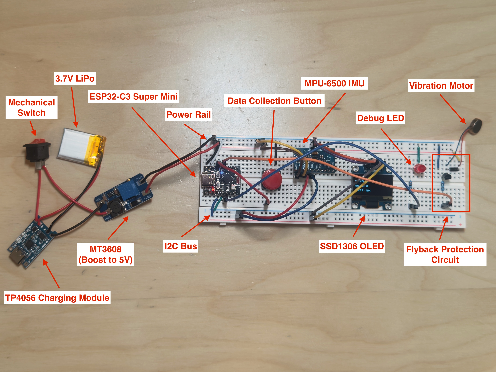

# Curl Tracker: Wearable Bicep Curl Coach (Work In Progress)

> This project was fully redesigned in June 2026. The original build history is preserved in ARCHIVE.md.

## What is Curl Tracker?

Curl Tracker is a wearable bicep curl tracker that uses an ESP32-C3 Super Mini alongside a MPU-6500 IMU to count reps, measure curl speed, and evaluate form in real-time. It uses a on-device classifier to distinguish good reps from common curl form faults. Curl Tracker displays live rep metrics to a SSD1306 OLED and streams data over MQTT to be plotted on a Python/matplotlib client. 

## Breadboard Prototype

A 3.7V LiPo battery (range: 3.0V - 4.2V) is charged by a TP4056 module which also has overcharge protection. A mechanical switch is used as a on/off switch. The MT3608 converts the noisy 3.7V LiPo, which can have varying voltage depending on the charge, to a stable 5V. 

The ESP32-C3 Super Mini is the MCU which serves as the brain for the project. The MPU-6500 IMU and SSD1306 OLED share a I2C bus which the ESP32 uses. The push button is used to provide the data-collection input used to label reps while gathering training data for the classifier. 

Feedback is handled by the status LED for the device state, the OLED is display rep count/sets/roll angle/and status of the MQTT, the vibration motor is used for haptic feedback. The flyback diode circuit helps protect against back-EMF when the motor turns off, protecting the ESP32. 

## KiCad Schematic & PCB layout 

## Installation / Usage

> This project is a work in progress. Firmware and hardware are still being made.
