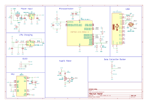

# Curl Tracker: Wearable Bicep Curl Coach (Work In Progress)

## What is Curl Tracker?

Curl Tracker is a wearable bicep curl tracker that uses an ESP32-C3 Super Mini alongside a MPU-6500 IMU to count reps, measure curl speed, and evaluate form in real-time. It uses a on-device classifier to distinguish good reps from common curl form faults. Curl Tracker displays live rep metrics to a SSD1306 OLED and streams data over MQTT to be plotted on a Python/matplotlib client. 

## Breadboard Prototype

### Design Choices:

- Power: 3.7V LiPo (range: 3.0V - 4.2V) with a TP4056 module for charging managment. MT3608 module converts the varying 3.7V Lipo to a stable 5V source. A mechanical switch is used as a on/off switch. 

- MCU & Peripherals: ESP32-C3 Super Mini is the MCU that serves as the brain for the project. MPU-6500 IMU and SSD1306 share a I2C bus which the ESP32 uses to communicate. A push button is used to provide data collection input to label reps while gathering training data for the classifier.

- Feedback: A status LED exists which turns on if any of the electronic malfunction. The OLED displays rep count, sets, and status of MQTT. The vibration motor, paired with a flyback diode circuit for back-EMF protection, is used for haptic feedback.

## KiCad Schematic & PCB layout 

### Design Choices: 

- 

## Installation / Usage

> This project is a work in progress. Firmware and hardware are still being made.
